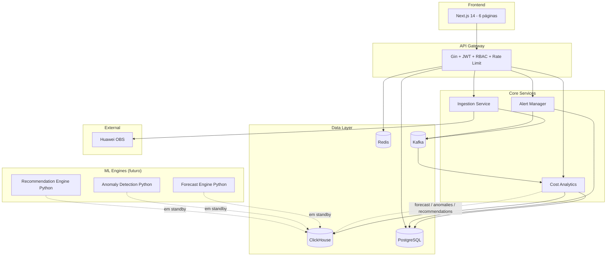
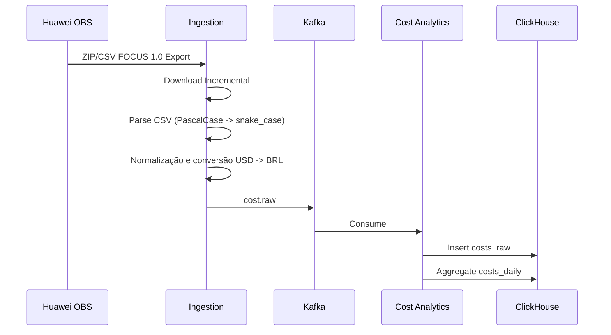
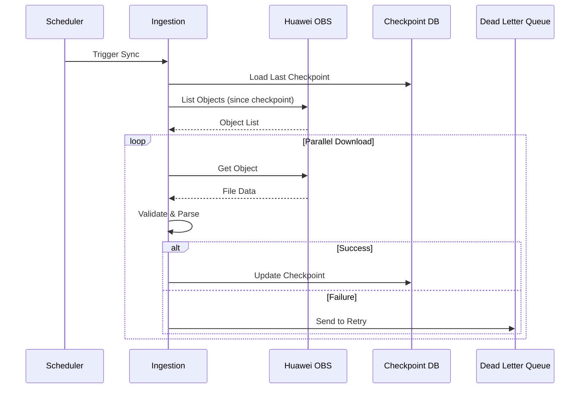
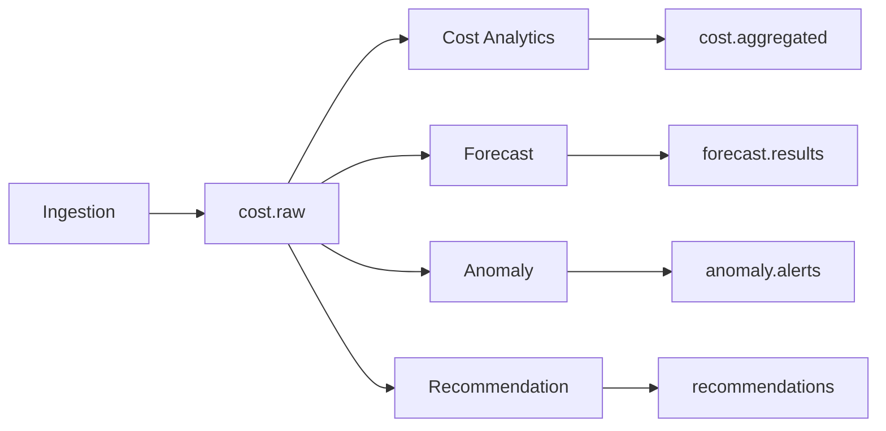
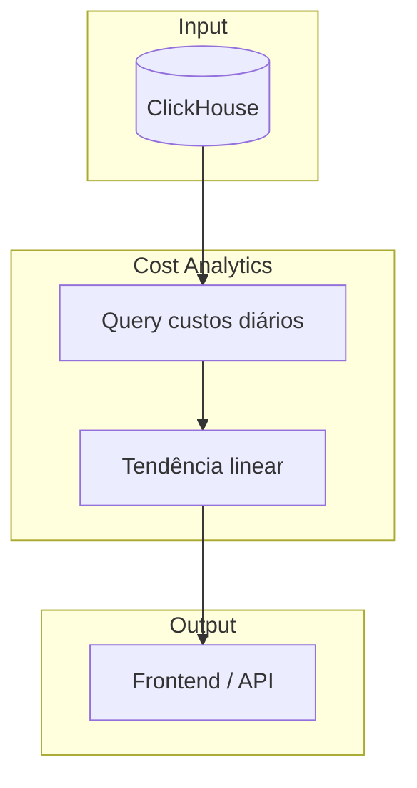
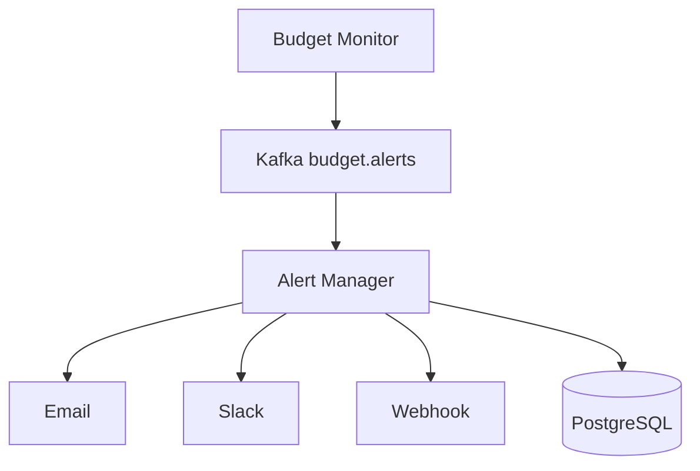

# Arquitetura FinOps Enterprise

## Visão Geral

Plataforma modular para gestão financeira de cloud, atualmente operando em ambiente **Huawei-only** via exportações FOCUS 1.0 armazenadas no OBS.

## Diagrama de Arquitetura

## Fluxo FOCUS

## Fluxo OBS

## Fluxo Kafka

## Fluxo Forecast (atual)

> A previsão utiliza regressão linear sobre a série temporal de custos reais. Modelos avançados (Prophet, ARIMA) estão no roadmap para integração futura via serviços Python.

## Fluxo Alertas (futuro)

> A página de Alertas foi removida do frontend. A funcionalidade será reintroduzida vinculada aos budgets: quando `spent > amount * alert_threshold`, um evento será publicado e notificado.

## Justificativa de Componentes

| Componente | Justificativa |
|------------|---------------|
| API Gateway | Ponto único de entrada. JWT, RBAC, Rate Limit, Auditoria, proxy para serviços |
| Ingestion Service | Isolamento do processamento de dados brutos FOCUS. Resiliência com checkpoint e DLQ |
| Cost Analytics | Separação de concerns. Processamento pesado em ClickHouse; consome Kafka; expõe forecast, anomalies e recommendations |
| Forecast Engine (Python) | Reservado para modelos avançados (Prophet, ARIMA). Em standby até integração com ClickHouse |
| Anomaly Detection (Python) | Reservado para algoritmos avançados (Isolation Forest). Em standby |
| Recommendation Engine (Python) | Reservado para análise de padrões de uso. Em standby |
| Alert Manager | Desacoplamento de notificações. Múltiplos canais. Será integrado aos budgets |
| ClickHouse | OLAP otimizado para analytics financeiro. Compressão, partições, TTL |
| PostgreSQL | ACID para metadata, configs, usuários, budgets, accounts |
| Kafka | Buffer entre ingestão e processamento. Backpressure handling |
| Redis | Cache de sessões, rate limiting, configs |

## Decisões de Arquitetura

1. **Microserviços controlados**: 7 serviços definidos, mas a lógica de forecast/anomalies/recommendations foi consolidada no `cost-analytics` para a pré-produção, reduzindo complexidade operacional enquanto os modelos Python não estão integrados.
2. **Huawei-first**: remoção deliberada de páginas e lógicas multi-cloud (Azure/AWS) para refletir o ambiente real de dados.
3. **Polyglot persistence**: ClickHouse para analytics, PostgreSQL para transacional.
4. **Event-driven**: Kafka como backbone entre ingestão e cost-analytics.
5. **Observability-first**: health checks, logs estruturados e endpoints `/metrics` em todos os serviços. Stack Prometheus/Grafana/Loki disponível no Docker Compose.
6. **Security by default**: JWT, RBAC, input validation, security headers. Em andamento: hash de senhas, login contra PostgreSQL e gestão segura de secrets (ver `ROADMAP.md`).
