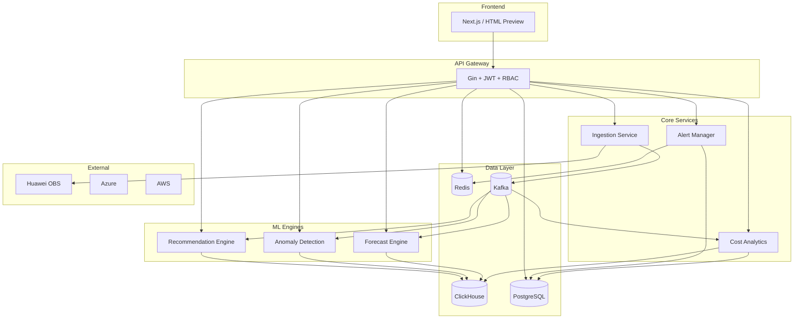
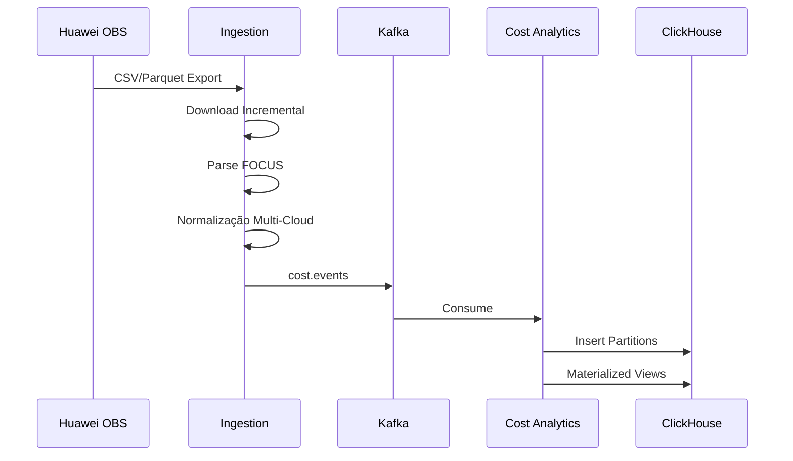
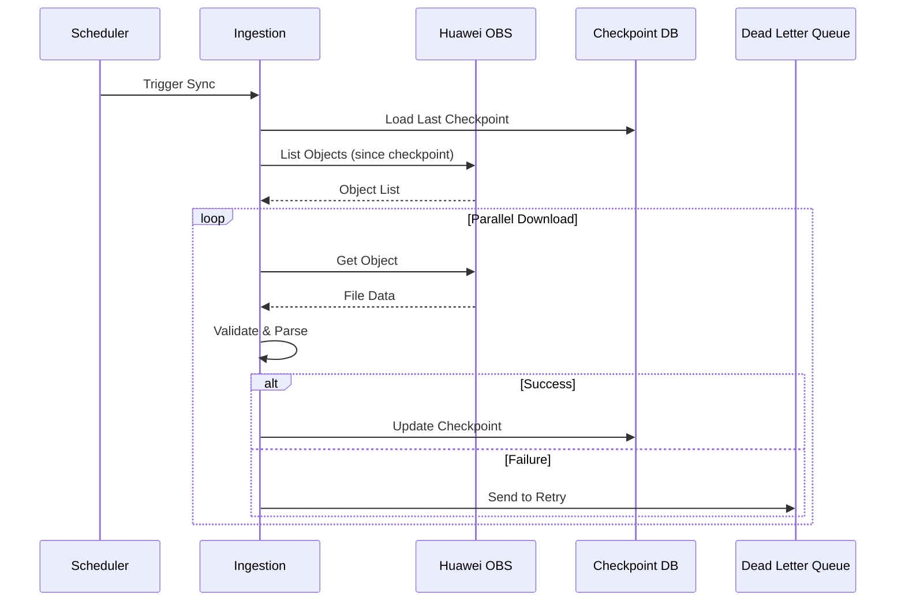
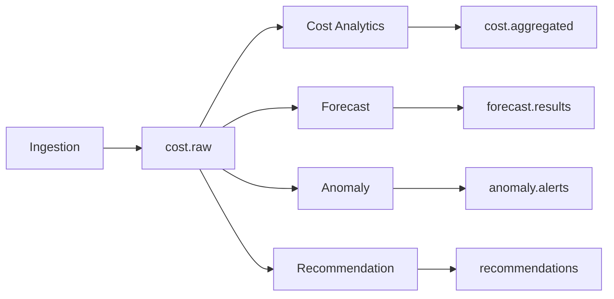
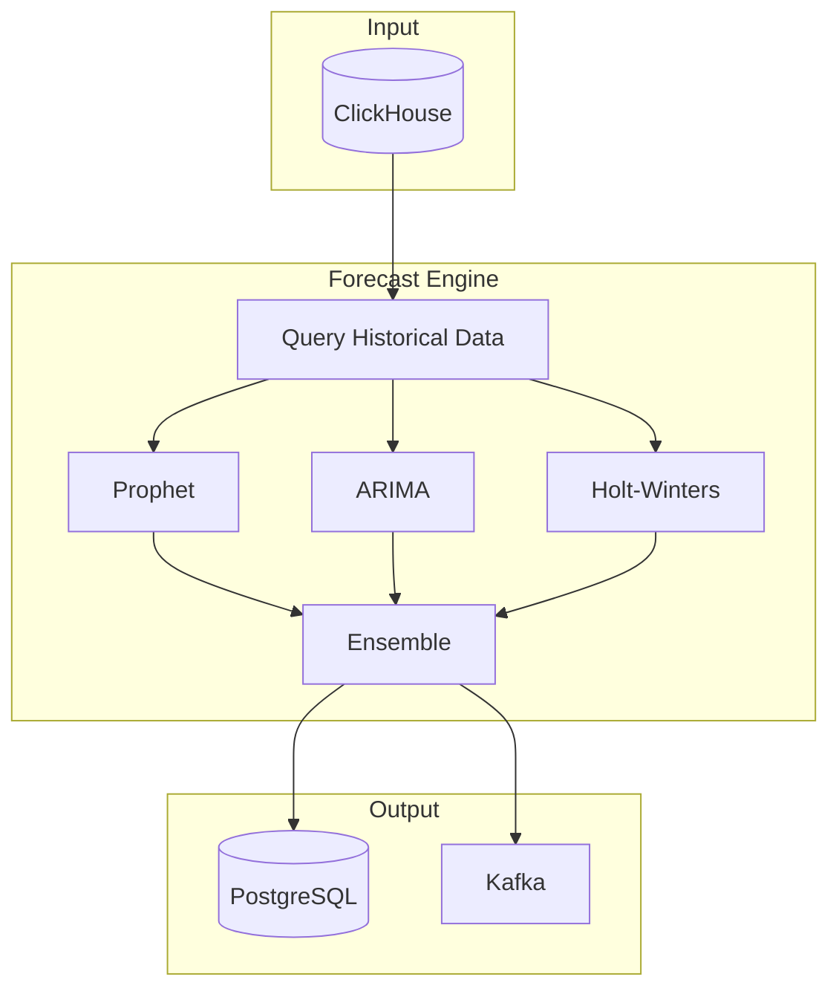
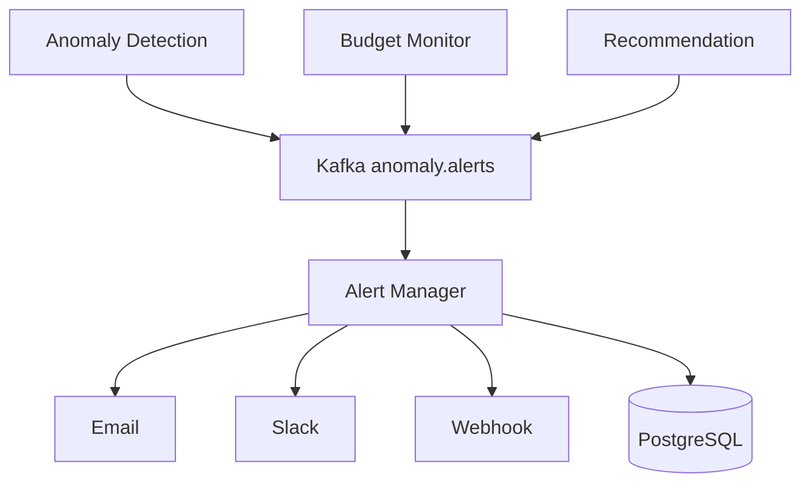

# Arquitetura FinOps Enterprise

## Visão Geral

Plataforma modular para gestão financeira de cloud multi-provedor.

## Diagrama de Arquitetura

## Fluxo FOCUS

## Fluxo OBS

## Fluxo Kafka

## Fluxo Forecast

## Fluxo Alertas

## Justificativa de Componentes

| Componente | Justificativa |
|------------|---------------|
| API Gateway | Ponto único de entrada. JWT, RBAC, Rate Limit, Auditoria |
| Ingestion Service | Isolamento do processamento de dados brutos. Resiliência com checkpoint e DLQ |
| Cost Analytics | Separação de concerns. Processamento pesado em ClickHouse |
| Forecast Engine | Python é padrão de mercado para séries temporais (Prophet, statsmodels) |
| Anomaly Detection | ML especializado. Isolation Forest para multivariado |
| Recommendation Engine | Regras + ML para rightsizing |
| Alert Manager | Desacoplamento de notificações. Múltiplos canais |
| ClickHouse | OLAP otimizado para analytics financeiro. Compressão, partições, MVs |
| PostgreSQL | ACID para metadata, configs, usuários |
| Kafka | Buffer entre ingestão e processamento. Backpressure handling |
| Redis | Cache de sessões, rate limiting, configs |

## Decisões de Arquitetura

1. **Microserviços controlados**: 7 serviços, cada um com responsabilidade única e justificável
2. **Polyglot persistence**: ClickHouse para analytics, PostgreSQL para transacional
3. **Event-driven**: Kafka como backbone para desacoplamento
4. **Observability-first**: OpenTelemetry em todos os serviços
5. **Security by default**: JWT, RBAC, input validation, security headers
